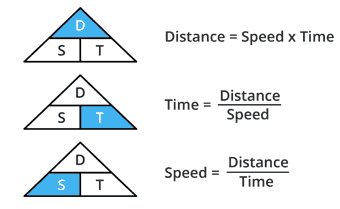
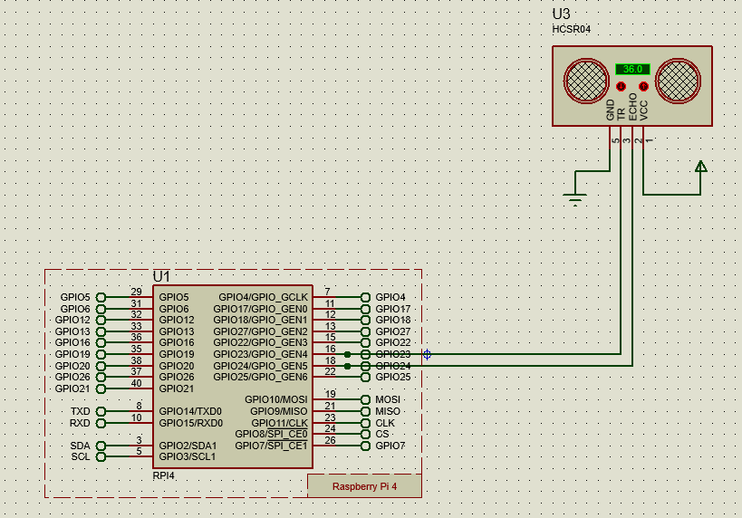
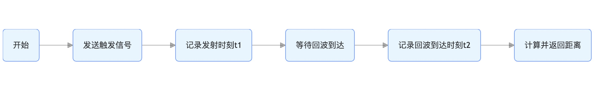

# 超声波
蝙蝠发射超声波，遇到目标后产生回波。通过分析回波时间和强度，可以精确判断目标位置。


## 什么是超声波？
超声波是一种电磁波，它通过空气传播并在遇到障碍物时反射回来具有方向性好、穿透能力强等特性
人类可以听到每秒振动约20次（低沉的隆隆声）至每秒20,000次（高音调的哨声）的声波。然而，超声波的频率超过20,000Hz，超出了人类听觉上限。超声波具有方向性好、穿透能力强等特性

### 超声波频率范围频谱

# Raspberry Pi GPIO教程-超声波传感器

## HC-SR04硬件概述

HC-SR04超声波距离传感器实际上由两个超声波换能器(Transducer)组成。一个用作发射器，将电信号转换为40KHz超声波脉冲。另一个用作接收器，监听发射的脉冲。

该传感器可提供2厘米至400厘米之间出色的非接触式范围检测，精度为3毫米。

由于它采用5伏电压运行，因此可以直接连接到Raspberry Pi或其他5V的逻辑微控制器。

### 技术规格
|操作电压|DC 5V|
|----|----|
|操作电流|15mA|
|操作频率|40KHz|
|最大检测范围|4m|
|最小检测范围|2cm|
|精度|3mm|
|量测角度|15 degree|
|触发输入信号|10µS TTL pulse|
|尺寸|45 x 20 x 15mm|

### HC-SR04超声波传感器引脚


VCC —— 为HC-SR04超声波传感器供电。将其连接到Raspberry Pi的5V输出。

Trig —— 接收外部触发信号来启动超声波发射。程序通过将此引脚设置为高电平10µs，传感器将启动超声波脉冲。

Echo —— 输出回声信号。当传感器发射的超声波遇到障碍物反射回来时，传感器会通过 echo 引脚输出一个高电平信号，其持续时间与超声波往返的时间成正比，通过测量这个时间，就能计算出传感器与障碍物之间的距离。

GND —— 接地引脚。可以将其连接到Raspberry Pi的接地。

## HC-SR04超声波距离传感器如何工作？
当触发引脚设置为高电平10µs时，一切就开始了。作为响应，传感器以40kHz的频率发射八个脉冲的超声波脉冲。这种8脉冲模式经过特殊设计，以便接收器能够区分发射脉冲和环境超声波噪声。

这八个超声波脉冲通过空气传播，远离发射器。同时，回声引脚变为高电平以启动回声信号。

如果这些脉冲没有被反射回来，回波信号就会超时并在38ms（38毫秒）后变低。因此，38ms的脉冲表示传感器范围内没有障碍物。


HC - SR04 超声波传感器最大检测距离约为 4 米。已知声音在空气中传播速度约为 340 米 / 秒。
超声波从传感器发射出去，碰到 4 米处的障碍物再反射回传感器，经过的路程是\(s = 4×2 = 8\)米（往返距离） 。根据公式\(t = s÷v\)，可得传播时间\(t = 8÷340 ≈ 0.0235\)秒，换算成毫秒约为 23.5ms。
考虑一定余量以及其他因素，通常取 38ms 作为超时时间。即如果在 38ms 内没有接收到回波信号，就认为传感器范围内没有障碍物 。
- 声速与温度相关，在标准大气压下，温度越高，声速越快 。
- 传感器内部电路在发射和接收超声波信号时，存在一定的延迟
- 实际应用环境中存在各种电磁干扰、声波反射干扰以及传感器安装方式和角度不同。超声波可能经过多次反射才被接收。

如果这些脉冲被反射回来，回声引脚在收到信号后会立即变低。这会在回声引脚上产生一个脉冲，其宽度具体取决于接收信号所需的时间。


## 计算距离
接收脉冲的宽度用于计算与反射物体的距离。这可以使用我们在高中学到的简单的距离-速度-时间方程来计算。记住这个方程的一个简单方法是将字母放在三角形中。

  

让我们举个例子来更清楚一点。假设我们在传感器前面有一个距离未知的物体，我们在回声引脚上接收到一个宽度为500µs的脉冲。现在让我们计算一下物体与传感器之间的距离。为此，我们将使用以下公式。

距离 = 速度 x 时间

这里我们有时间值，即500µs，我们知道速度。当然是声速！它是340m/s。要计算距离，我们需要将声速转换为cm/µs。它是0.034cm/μs。有了这些信息，我们现在可以计算距离了！

距离 = 0.034 cm/µs x 500 µs

但我们还没有完成！请记住，回声脉冲表示信号发送和反射回来所需的时间。因此，要得到距离，您必须将结果除以二。

距离 = (0.034 cm/µs x 500 µs) / 2 = 8.5cm

## 接线
将HC-SR04连接到Pi非常简单。将VCC引脚连接到Pi的5V引脚，将GND引脚连接到接地引脚。现在将触发和回声引脚分别连接到GPIO引脚23和24。

## 超声波测距原理

## 超声波测距流程图

## 超声波关键代码块

## 超声波测距代码（带超时验证及异常处理）
输入以下代码：
```python
    # 发送触发信号
    GPIO.output(self.trigger_pin, GPIO.HIGH)
    time.sleep(0.00001)  # 10μs脉冲
    GPIO.output(self.trigger_pin, GPIO.LOW)
            
    # 记录发射时刻
    t1 = time.time()
    timeout = t1 + 0.038  # 38ms超时
            
    # 等待回波到达
    while GPIO.input(self.echo_pin) == 0:
        if time.time() > timeout:
            return float('inf')
            
    # 等待回波结束
    t2 = time.time()
    while GPIO.input(self.echo_pin) == 1:
        if time.time() > timeout:
            return float('inf')
        t2 = time.time()
            
    # 计算距离
    return (t2 - t1) * 34300 / 2  # 单位：厘米

```
## 有哪些局限性？
HC-SR04超声波传感器在精度和整体可用性方面确实非常出色，尤其是与其他低成本超声波传感器相比。这并不意味着HC-SR04传感器将会一直很好地工作。下图显示了HC-SR04的一些局限性：
1. 传感器与物体/障碍物之间的距离大于4米(13ft)。

2. 物体的反射面角度较小，因此声音不会反射回传感器。

3. 物体太小，无法将足够多的声音反射回传感器。另外，如果您的HC-SR04传感器安装在设备上较低位置，则可能接收到从地板反射的声音。

4. 一些表面柔软、不规则的物体（例如毛绒动物）会吸收声音而不是反射声音，因此HC-SR04传感器可能难以检测到此类物体。

