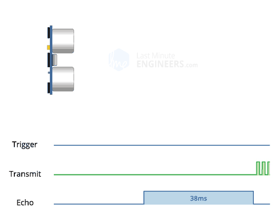

# Raspberry Pi GPIO教程-超声波传感器


# 超声波
蝙蝠发射超声波，遇到目标后产生回波。通过分析回波时间和强度，可以精确判断目标位置。


## 什么是超声波？
超声波是一种电磁波，具有方向性好、穿透能力强等特性。它能通过空气传播并在遇到障碍物时反射回来，非常适合应用在测距和发现障碍物。

人类可以听到每秒振动约20次（低沉的隆隆声）至每秒20,000次（高音调的哨声）的声波。那么，频率超过20,000Hz的声波就是超声波，超出了人类听觉上限。


## HC-SR04硬件概述


HC-SR04超声波距离传感器实际上由两个超声波换能器组成。一个用作发射器，将电信号转换为40KHz超声波脉冲。另一个用作接收器，监听发射的脉冲。

该传感器可提供2厘米至400厘米之间出色的非接触式范围检测，精度为3毫米。

由于它采用5伏电压运行，因此可以直接连接到Raspberry Pi或其他5V的逻辑微控制器。

**技术规格**
|操作电压|DC 5V|
|操作电流|15mA|
|操作频率|40KHz|
|最大检测范围|4m|
|最小检测范围|2cm|
|精度|3mm|
|量测角度|15 degree|
|触发输入信号|10µS TTL pulse|
|尺寸|45 x 20 x 15mm|

**HC-SR04超声波传感器引脚**


VCC —— 为HC-SR04超声波传感器供电。将其连接到Raspberry Pi的5V输出。

Trig —— 接收外部触发信号来启动超声波发射。程序通过将此引脚设置为高电平10µs，传感器将启动超声波脉冲。

Echo —— 输出回声信号。当传感器发出超声波时，传感器会通过echo引脚输出一个高电平信号。其持续时间就是超声波往返的时间，通过测量这个时间，就能计算出传感器与障碍物之间的距离。

GND —— 接地引脚。可以将其连接到Raspberry Pi的接地。

## 接线方法
将HC-SR04连接到Pi非常简单。将VCC引脚连接到Pi的5V引脚，将GND引脚连接到接地引脚。现在将触发和回声引脚分别连接到GPIO引脚23和24。


#### 练习1:补充测距核心代码
## HC-SR04控制超声波发送及电平控制原理
当程序吧trig引脚设置为高电平10µs时，传感器以40kHz的频率发射八个脉冲的超声波脉冲。这种8脉冲模式经过特殊设计，以便接收器能够区分发射脉冲和环境超声波噪声。
这八个超声波脉冲发射完成后。模块会立即通过echo引脚输出高电平，并持续保持。直到超声波遇到障碍物并返回被接收器检测到，这是echo引脚改为输出低电平。
因此，echo引脚的高电平持续时间等于超声波从发射到返回的总时间（即往返时间）。


如果这些脉冲没有被反射回来，回波信号就会超时并在38ms（38毫秒）后变低。因此，38ms的脉冲表示传感器范围内没有障碍物。



HC - SR04 超声波传感器最大检测距离约为 4 米。已知声音在空气中传播速度约为 343 米 / 秒。
超声波从传感器发射出去，碰到 4 米处的障碍物再反射回传感器，经过的路程是\(s = 4×2 = 8\)米（往返距离） 。根据时间距离传播时间\(t = 8÷343 ≈ 0.0233\)秒，约为 23.3ms。
有一些情况会使实际的传输时间大于23.3ms
- 声速与温度相关，在标准大气压下，温度越高，声速越快 。
- 传感器内部电路在发射和接收超声波信号时，存在一定的延迟
- 实际应用环境中存在各种电磁干扰、声波反射干扰以及传感器安装方式和角度不同。超声波可能经过多次反射才被接收。
考虑一定余量以及其他因素，通常取 38ms 作为超时时间。即如果在 38ms 内没有接收到回波信号，就认为传感器范围内没有障碍物 。

## HC-SR04超声波测距原理


**超声波测距代码流程图**


#### 练习2:补充测距核心代码
distance_measure_null.py


```python
    def measure(self):
        """Execute distance measurement"""
        try:
           # 给传感器发送触发信号（10微秒高电平）
            GPIO.output(self.trigger_pin, GPIO.HIGH)
            time.sleep(0.00001)  # 10μs pulse
            GPIO.output(self.trigger_pin, GPIO.LOW)
            # W等待回波开始（发出超声波）
            while GPIO.input(self.echo_pin) == GPIO.LOW:
                pass
            # 记录开始时间
            t1 = time.time()
            # 等待回波结束（接收到反射回来的超声波）
            while GPIO.input(self.echo_pin) == GPIO.HIGH:
                pass
            # 记录结束时间
            t2 = time.time()
            # # 计算距离
            return (t2 - t1) * 34300 / 2  # Unit: centimeters
        except Exception as e:
            print(f"[ERROR] Measurement failed @ {time.strftime('%Y-%m-%d %H:%M:%S')}: {str(e)}")
            return None

```

## 添加38ms超时验证
- 当传感器没有检测到障碍物时，echo会一直保持高电平状态，直到超声波往返时间超过38ms，然后传感器会自动将echo引脚置为低电平。
我们可以完全依赖传感器的超时吗？
- 别忘了我们38ms的时间长度是在23ms加了很多冗余的。非极端情况下，38ms的时间直接对应6.5m，早就超过了传感器的4m极限。如果不在 measure() 中处理超时，每次测量在无回波时都会强制等待 38ms，即使实际障碍物距离远超4米，这会显著降低测量效率。
- 传感器损坏时，echo 引脚可能始终为低电平，代码将永远无法退出第一个循环。
- 我们可以在 measure() 中添加超时验证，当超过 38ms 没有接收到回波信号时，我们可以认为传感器没有检测到障碍物，返回一个较大的值（如 float('inf')）。这样，我们就可以在主程序中对这个值进行处理，而不是一直等待。
#### 练习3：在 measure() 中添加超时验证。


输入以下代码：
```python
    def measure(self):
        """Execute distance measurement"""
        try:
            # Send trigger signal
            GPIO.output(self.trigger_pin, GPIO.HIGH)
            time.sleep(0.00001)  # 10μs pulse
            GPIO.output(self.trigger_pin, GPIO.LOW)

            t0 = time.time()
            # Wait for echo to go out
            while GPIO.input(self.echo_pin) == 0:
                if time.time() - t0 > 0.038:
                    return float('inf')
            # Record emission time
            t1 = time.time()

            # Wait for echo to return
            while GPIO.input(self.echo_pin) == 1:
                if time.time() - t0 > 0.038:
                    return float('inf')
                t2 = time.time()
            
            # Calculate distance
            return (t2 - t1) * 34300 / 2  # Unit: centimeters
        
        except Exception as e:
            print(f"[ERROR] Measurement failed @ {time.strftime('%Y-%m-%d %H:%M:%S')}: {str(e)}")
            return None

```
## 代码运行
- ssh admin@raspberrypi.local
- nano distance.py （粘贴代码到文件中）
- 保存退出：Ctrl + O → Enter → Ctrl + X
- python3 distance.py
- Ctrl + C 退出
#### 练习4：运行代码

## HC-SR04的局限性？
HC-SR04超声波传感器在精度和整体可用性方面确实非常出色，尤其是与其他低成本超声波传感器相比。这并不意味着HC-SR04传感器将会一直很好地工作。下图显示了HC-SR04的一些局限性：
1. 传感器与物体/障碍物之间的距离大于4米(13ft)。


2. 物体的反射面角度较小，因此声音不会反射回传感器。


3. 物体太小，无法将足够多的声音反射回传感器。另外，如果您的HC-SR04传感器安装在设备上较低位置，则可能接收到从地板反射的声音。


4. 一些表面柔软、不规则的物体（例如毛绒动物）会吸收声音而不是反射声音，因此HC-SR04传感器可能难以检测到此类物体。


## 附加实践：添加蜂鸣器实现坐姿检测
为了增加一个简单的报警功能，我们可以在超声波传感器的基础上添加一个蜂鸣器模块。当检测到的距离超过20厘米时，蜂鸣器将发出报警声。

**蜂鸣器接线说明**
有源蜂鸣器模块有两个引脚：
- VCC：连接到树莓派的5V电源
- GND：连接到树莓派的地线（GND）
- SIGNAL：信号线，连接到GPIO 25（BCM编号）

**使用带蜂鸣器的代码**
新的Python代码文件`distance_with_buzzer.py`在原有测距功能的基础上增加了蜂鸣器控制。当检测到的距离超过20厘米时，蜂鸣器会发出报警声。
#### 练习5：实践坐姿检测

## GPIO busy解决方法

1 切记control+c退出，不要control+z （只是暂时前台退出，后台还在占用端口）
2 取消占用方法：
- 查看所有Python进程
ps aux | grep python

- 强制终止所有残留进程
sudo kill -9 PID  # 根据实际进程ID操作

- 清除所有GPIO占用状态
sudo gpio unexportall  # 清理GPIO状态


## 教学总结
1. **原理**：超声波传感器通过发射/接收40kHz脉冲测距，利用声速(343m/s)计算往返时间。  
2. **核心代码**：触发10μs高电平启动测量，记录Echo高电平持续时间，超时38ms返回无限大。  
3. **接线关键**：VCC接5V，Trig/Echo接GPIO，注意避免引脚冲突。  
4. **局限**：最大测距4米，受物体材质、角度影响，柔软/小物体可能无法反射。  
5. **优化**：代码需处理超时和异常，避免进程占用GPIO。  
6. **应用**：适用于非接触测距，但需考虑环境干扰和物理限制。
  
## 课后作业：
1 文档提到声速受温度影响（标准大气压下，温度越高声速越快）。若要在代码中动态修正声速，你会如何获取环境温度数据？请简述思路（例如使用温度传感器）。
2 HC-SR04的替代方案包括激光测距和红外测距。搜索资料，从成本、精度、抗干扰性等角度，分析这三种技术的优缺点。