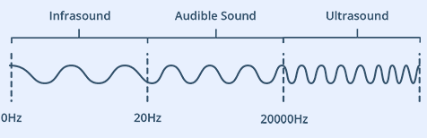
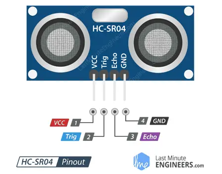
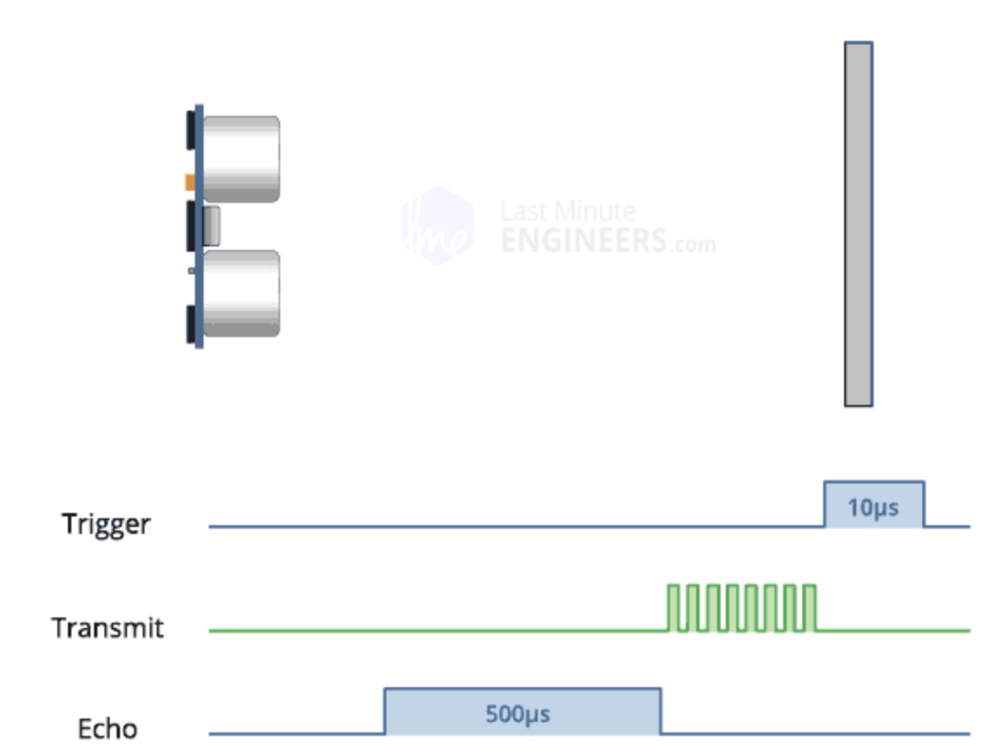

# **Raspberry Pi + 超声波传感器测距实验**  
### 实验目标
- 了解超声波传感器的工作原理。
- 掌握树莓派与超声波传感器的连接方法。
- 编写Python代码实现超声波测距功能。
- 延伸应用
   - 坐姿提醒器（距离超限报警）。  
   - 倒车雷达模拟（距离越近蜂鸣越急促）。

### **1. 初识超声波**  
**（像蝙蝠一样“看”世界）**  



人类可以听到每秒振动约20次（低沉的隆隆声）至每秒20,000次（高音调的哨声）的声波。那么，频率超过20,000Hz的声波就是超声波，超出了人类听觉上限。

超声波属于一种机械波，它能通过空气传播并在遇到障碍物时反射回来，非常适合应用在测距和发现障碍物。

蝙蝠发射超声波，遇到目标后产生回波。通过分析回波时间和强度，可以精确判断目标位置。


### **2. 认识我们的工具：HC-SR04传感器**  
- **传感器外观**：像两个小眼睛（发射器+接收器）。  


- **引脚功能**：  

  | 引脚 | 作用 | 连接树莓派 |  
  |---|---|---|  
  | VCC | 供电 | 5V电源 |  
  | Trig | 发射超声波 | GPIO 23 |  
  | Echo | 接收回波 | GPIO 24 |  
  | GND | 接地 | GND |  
- **关键技术参数**：  
  - 测距范围：2cm~4m  
  - 精度：3mm  
- **HC-SR04超声波传感器的工作原理**  
  - **1. 超声波发射与接收流程**  
    - **触发信号（Trig引脚）**：  
        当程序将Trig引脚设置为**高电平10μs**时，发射器会以**40kHz频率**发射**8个超声波脉冲**。  
    - **为什么是8个脉冲？**  
        这种设计能让接收器区分发射信号与环境噪声（如其他超声波干扰）。  

    - **回波信号（Echo引脚）**：  
    1. **发射阶段**：8个脉冲发射完成后，Echo引脚立即输出**高电平**。  
    2. **接收阶段**：当超声波遇到障碍物并返回，接收器接收到时，Echo引脚变为**低电平**。  
    - **关键测量值**：Echo高电平的持续时间 = 超声波往返时间。  

      

  - **2. 超时机制（无障碍物情况）**  
    - 如果超声波未被反射（无障碍物），Echo引脚会在**38ms后自动置为低电平**。  
    - **为什么是38ms？**  
        - 理论最大往返时间（4米障碍物）：23.3ms（计算：8m ÷ 343m/s）。  
        - 实际冗余设计：考虑声速受温度影响、电路延迟、多路径反射等，预留安全余量。  

      
    *▲ 无障碍物时Echo引脚超时复位（38ms后变低）*

---

| 场景                | Echo引脚信号          | 处理方式               |  
|---------------------|-----------------------|------------------------|  
| 检测到障碍物        | 高电平（持续往返时间）| 计算距离               |  
| 未检测到障碍物      | 高电平（38ms后变低）  | 返回“无限远”或超时错误 |  

---

### **3. 动手连接树莓派**   
- **所需材料**：树莓派、HC-SR04、杜邦线。  
- **接线步骤**：  
  1. 关闭树莓派电源。  
  2. 用杜邦线按上表连接传感器（彩色线更易区分）。  


- **检查点**：  
  ✅ VCC是否接5V？（接错会烧坏！）  
  ✅ GPIO编号是否正确？（23和24）  

---

### **4. 编程实战：测距小实验**  
- **核心原理**：  
  - 发送超声波 → 碰到障碍物 → 反弹回来 → 计算时间 → 得出距离。  
  - 公式：距离 = (时间 × 声速) ÷ 2（声速≈343m/s）。  
  
  
- **基础测距逻辑实现练习**：
[distance_measure_null](./src/distance_measure_null.py)
- **超时保护逻辑添加练习**：   
  - 当传感器没有检测到障碍物时，echo会一直保持高电平状态，直到超声波往返时间超过38ms，然后传感器会自动将echo引脚置为低电平。我们可以完全依赖传感器的超时吗？
    - 别忘了我们38ms的时间长度是在23ms加了很多冗余的。非极端情况下，38ms的时间直接对应6.5m，早就超过了传感器的4m极限。加超时等待可以动态调整超时时间：根据传感器的使用环境和目标距离范围动态调整超时时间。也可以结合其他异常处理逻辑：能对传感器状态进行诊断，或者尝试重新初始化传感器，增强程序的健壮性和稳定性 。
    - 传感器损坏时，echo 引脚可能始终为低电平，代码将永远无法退出第一个循环。
  - 如果超过38ms没回声，说明“太远或没障碍物”（返回`无限大`）。
[distance_overtime_null](./src/distance_overtime_null.py)
[distance_simple](./src/distance_simple.py)
---
#### **代码运行**
- ssh admin@raspberrypi.local
- nano distance.py （粘贴代码到文件中）
- 保存退出：Ctrl + O → Enter → Ctrl + X
- python3 distance.py
- Ctrl + C 退出

#### **局限与改进**
**（为什么测不准？）**  
- **常见问题**：  
1. 传感器与物体/障碍物之间的距离大于4米(13ft)。


2. 物体的反射面角度较小，因此声音不会反射回传感器。


3. 物体太小，无法将足够多的声音反射回传感器。


4. 一些表面柔软、不规则的物体（例如毛绒动物）会吸收声音而不是反射声音，因此HC-SR04传感器可能难以检测到此类物体。

 

5. 另外，如果传感器安装在设备上较低位置，则可能接收到从地板反射的声音。
- **改进思路**：  
  - 多次测量取平均值。  
  - 调整传感器角度（正对目标）。  

### **5. 创意拓展：坐姿提醒器 + 倒车报警**  
#### **材料升级**  
- **基础材料**：树莓派、HC-SR04、有源蜂鸣器、 面包板。  
 
  | 引脚 | 作用 | 连接树莓派 |  
  |---|---|---|  
  | VCC | 供电 | 3.3V电源 |  
  | I/O | 信号 | GPIO 25 |   
  | GND | 接地 | GND |  


#### **功能1：坐姿提醒器**  
- **逻辑**：检测头部距离小于20cm时蜂鸣器报警。  
- **代码片段**：  
  ```python
  if 距离 < 20:  
      GPIO.output(蜂鸣器引脚, GPIO.LOW)   
  ```  
[distance_with_buzzer_v1](./src/distance_with_buzzer_v1.py)

#### **功能2：倒车报警**  
- **逻辑**：距离越近，蜂鸣声越急促（频率渐变）。  
- **代码优化**：  
  ```python
  # 定义警报频率  
        if distance < 5:  # 近距离（0-5厘米）
            GPIO.output(BUZZER_PIN, GPIO.LOW)
            time.sleep(0.01)
            GPIO.output(BUZZER_PIN, GPIO.HIGH)
            time.sleep(0.01)
        elif distance < 10:  # 中距离（5-10厘米）
            GPIO.output(BUZZER_PIN, GPIO.LOW)
            time.sleep(0.05)
            GPIO.output(BUZZER_PIN, GPIO.HIGH)
            time.sleep(0.05)
  ```  

[distance_with_buzzer_v2](./src/distance_with_buzzer_v2.py)


### **6. 常见问题解答**  
- 代码报错“GPIO被占用”？  
    1 切记control+c退出，不要control+z （只是暂时前台退出，后台还在占用端口）
    2 取消占用方法：
    - 查看所有Python进程
        ps aux | grep python
    - 强制终止所有残留进程
        sudo kill -9 PID  # 根据实际进程ID操作
    - 清除所有GPIO占用状态
        sudo gpio unexportall  # 清理GPIO状态

- 蜂鸣器一直响？  
    - 确认电平模式是否和代码一致
    - 确认电源线是3.3V，地线连接准确
---
### 教学总结
1. **原理**：超声波传感器通过发射/接收40kHz脉冲测距，利用声速(343m/s)计算往返时间。  
2. **核心代码**：触发10μs高电平启动测量，记录Echo高电平持续时间，超时38ms返回无限大。  
3. **接线关键**：VCC接5V，Trig/Echo接GPIO，注意避免引脚冲突。  
4. **局限**：最大测距4米，受物体材质、角度影响，柔软/小物体可能无法反射。  
5. **优化**：代码需处理超时和异常，避免进程占用GPIO。  
  
### 课后作业
1 声速受温度影响（标准大气压下，温度越高声速越快）。若要在代码中动态修正声速，怎么做呢？

2 HC-SR04的替代方案包括激光测距和红外测距。搜索资料，从成本、精度、抗干扰性等角度，分析这三种技术的优缺点。 

