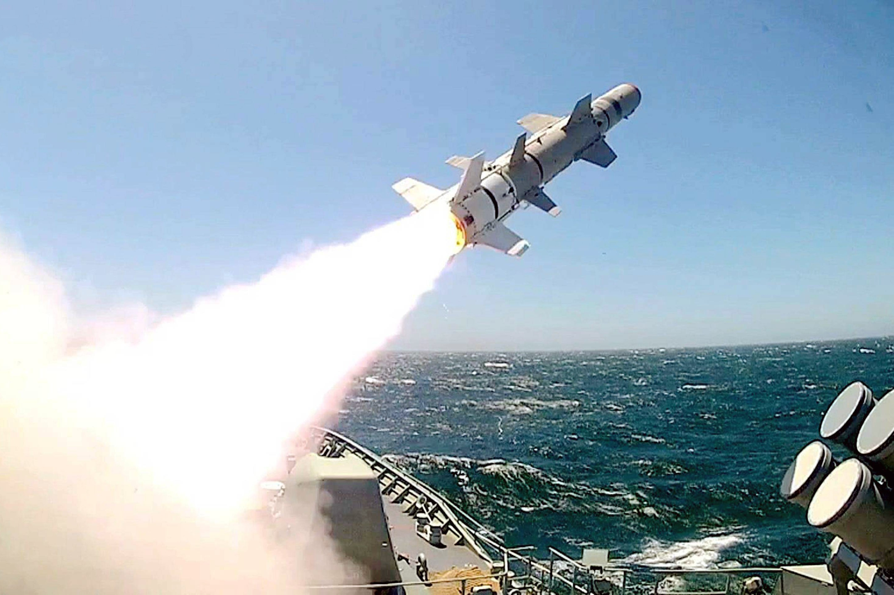
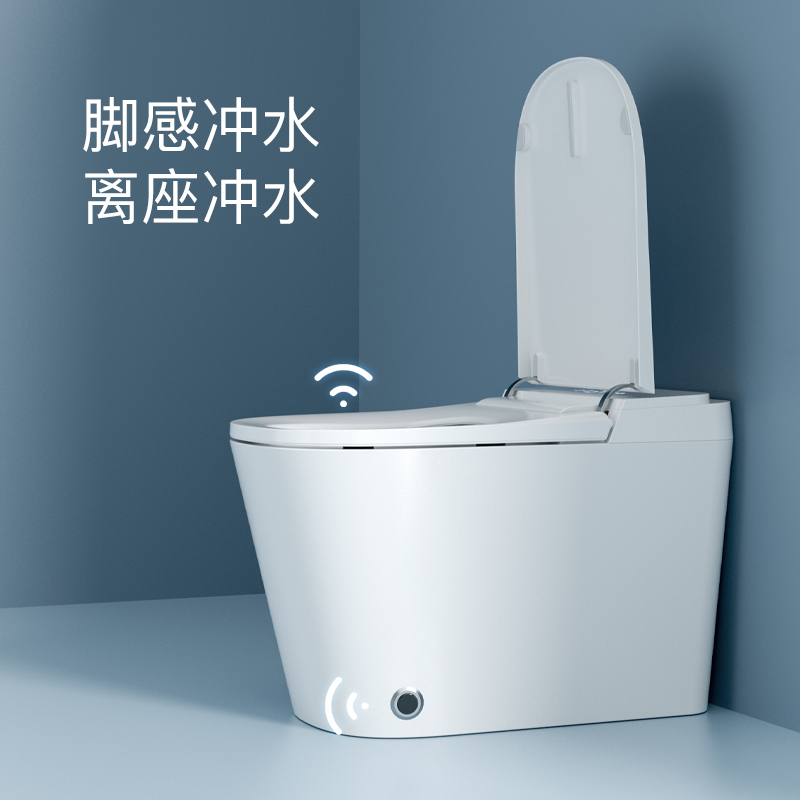

同学们，视频先暂停一下。刚才这段空战是不是特别精彩？我们看到了F/A-18超级大黄蜂和苏-57在空中激烈对抗，还有导弹发射的惊险场面。大家在感叹特效震撼的同时，有没有思考过一个问题：在如此高速复杂的空战环境中，飞行员究竟是依靠什么技术，能够快速、精准地判断敌机的距离，从而抓住时机发起攻击的呢？ 
其实，在这些科幻感十足的军事装备背后，藏着一个大家马上要亲手掌握的核心技术 —— 非接触测距：战斗机的火控雷达通过发射接收电磁来计算与敌机的距离；导弹的制导系统则通过雷达或激光测距，实时调整飞行轨迹，精准命中目标；而地面的防空系统，更是依赖测距技术，提前预判敌方飞行器的距离和方位，实现有效拦截。
这项听起来 “高大上” 的技术，其实早已悄悄融入我们的日常生活。走进公共卫生间，当你离开马桶旁，水流便自动涌出冲洗，这背后正是超声波传感器在 “暗中观察”—— 它不断发射超声波，当检测到人体离开，反射信号减弱，便触发冲水装置。还有大家熟悉的倒车雷达，车尾的小探头发射超声波，遇到障碍物后反射回来，通过计算声波往返的时间，将距离转化为 “滴滴” 的提示音，让新手司机也能轻松停车入库。再比如智能家居中的自动感应灯，人一靠近就亮起来，就像长了双 “眼睛” 一样敏锐。当我们晚上迷迷糊糊起来上厕所的时候，简直救大命
无论是改变现代战争格局的尖端武器，还是让生活更便利的智能设备，非接触测距技术的核心原理都和我们即将学习的超声波测距如出一辙！接下来，我们将亲手搭建一个简易的超声波测距装置，像电影里的工程师一样，用声音丈量世界”